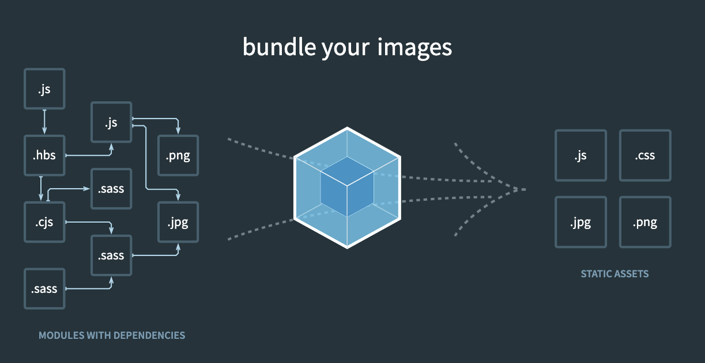

# webpack

작성날짜: May 04, 2020 12:56 PM
작성자: Jeon seongbin
참조 사이트: https://joshua1988.github.io/webpack-guide/build/node-npm.html#node-js%EC%99%80-npm
참조사이트: https://opentutorials.org/module/4566

Node.js NPM가 설치되어 있어야 한다

일정 버전 이상의 npm과 nodejs가 설치 되어 있어야 한다

# 웹팩이란?

1. bundler이다(여러개의 파일을 묶어주는 도구)
2. 브라우저는 js css 방식으로 코드를 읽는다
3. 우리가 개발을 진행 할 땐 여러 확장자 인데 여러 확장자(모듈(웹 어플리케이션을 구성하는 모든 자원들)) 들을 js css jpg png등으로 브라우저가 실행 할 수 있는 확장자로 바꾸어 주는 역할을 한다(번들러)



웹팩은 노드js에서 실행된다

```jsx
npm init
npm install webpack webpack —save-dev
```

npm 을 초기화하고 npm에서 webpack을 지역설치 한다(다른pc에서 쓸 수 있도록 한다)

## package.json(NPM)

버전을 명시한다

npm install 을 하면 npm이 package json 에 있는 내용을 보고 필요한 모듈을 다운로드 한다

script객체는 npm명령어를 실행할 때 사용한다

npm은 필요한 모듈을 이 파일을 보고 다운로드 하기 때문에 npde_modules라는 파일을 git에 올릴 필요가 없다

```jsx
예시
  "webpack": "webpack --mode production"
  "webpack": "webpack --mode development"
에 따라 번들링 한 결과가 달라진다
```

```jsx
{
  "name": "vuestudy",
  "version": "1.0.0",
  "description": "webpack",
  "main": "index.js",
  "scripts": {
    "webpack": "webpack --mode production",
    "dev": "webpack-dev-server --mode development"
  },
  "keywords": [
    "webpack"
  ],
  "author": "",
  "license": "ISC",
  "devDependencies": {
    "@babel/core": "^7.9.6",
    "@babel/preset-env": "^7.9.6",
    "autoprefixer": "^9.7.6",
    "babel-eslint": "^10.1.0",
    "babel-loader": "^8.1.0",
    "clean-webpack-plugin": "^3.0.0",
    "copy-webpack-plugin": "^5.1.1",
    "css-loader": "^3.5.3",
    "html-webpack-plugin": "^4.3.0",
    "node-sass": "^4.14.0",
    "postcss-loader": "^3.0.0",
    "sass": "^1.26.5",
    "sass-loader": "^8.0.2",
    "vue-loader": "^15.9.2",
    "vue-style-loader": "^4.1.2",
    "vue-template-compiler": "^2.6.11",
    "webpack": "^4.43.0",
    "webpack-cli": "^3.3.11",
    "webpack-dev-server": "^3.10.3"
  },
  "dependencies": {
    "vue": "^2.6.11"
  }
}
```

package-lock.json

package json 에 필요한 추가정보들을 명시한다

package.json 에 명시된 정보에 따라 저장되기 때문에 볼 필요는 없다(?)

## webpack.config.js(webpack)

webpack의 설정을 명시한다

웹팩에서 빌드 할 파일이나 필요한 플러그인을 명시한다

```jsx
const path = require("path"); // __dirname 현재위치 이용하기 위해서 사용
const VueLoaderPlugin = require("vue-loader/lib/plugin");
const HtmlWebpackPlugin = require("html-webpack-plugin");
const { CleanWebpackPlugin } = require("clean-webpack-plugin");
const CopyPlugin = require('copy-webpack-plugin');

module.exports = {
    entry: {
        app: path.join(__dirname, "src", "index.js"),
        //__dirname -> 웹팩 이 설정되어있는 위치
        //에서 index.js가 웹팩 이 실행되어지는 위치
    },
    // 처음 시작점(input하는 파일)

    output: {
        filename: "test.js",
        path: path.join(__dirname, "dist"),
        //dist라는건 관용적으로 씀
        //build
    },
    module: {
        rules: [
            {
                test: /\.vue$/,
                use: "vue-loader",
            },
            {
                test: /\.js$/,
                use: "babel-loader",
            },
            {
                test: /\.css$/,
                use: ["vue-style-loader", "css-loader"],
            },
            {
                test: /\.sass$/,
                use: [
                    "vue-style-loader",
                    "css-loader",
                    "postcss-loader",
                    "sass-loader",
                ]
            }
        ],

    },
    plugins: [
        new VueLoaderPlugin(),
        new HtmlWebpackPlugin({
            template: path.join(__dirname, "src", "index.html"),
        }),
        new CopyPlugin([{ from: "src/assets/", to: "assets/" }]),
        new CleanWebpackPlugin(),
    ],
    devServer: {
        contentBase: path.join(__dirname, 'dist'),
        compress: true,
        port: 9000,
    },
}
```

## webpack의 구성

### entry

웹팩 번들링을 위한 input파일의 경로

```jsx
//webpack.config.js
const path = require("path");

module.export = {
	entry: path.join(__dirname,"src","index.js"),
}
```

webpack.config.js 가 있는 path의 src폴더 밑 index.js 가 웹팩이 빌드 할 대상파일이 된다

### output

웹팩이 번들링을 한 결과파일과 경로

```jsx
module.export = {
	...
	output : {
		filename : "test.js",
		path : path.join(__diranme, "dist"),
	}
	...
}
```

webpack.config.js 가 있는 path의 dist 에 test.js에 결과 파일을 출력한다

[id],[name]등의 옵션이 있는데 나도 잘 모르겠음..

### loader

웹팩에 자바스크립트 자원이 아닌 것들 을 로딩한다

```jsx
module.export = {
	...
	module: {
		rules: [
			{
				test: /\.css$/
				use: ['css-loader'],
			}
		],
	}
	...
}
```

css인 파일을 웹팩에 로딩한다

- `test` : 로더를 적용할 파일 유형 (일반적으로 정규 표현식 사용)
- `use` : 해당 파일에 적용할 로더의 이름

로더 적용 순서

특정 파일에 대해 여러 로더를 적용 할 시, 로더 적용 순서에 주의 해야 한다

오른쪽에서 왼쪽 순으로 적용한다

```jsx
module.export = {
	...
	module = {
		rules : [
			{
				test : "/\.sass$/",
				use : ["style-loader","css-loader","sass-loader"]
			}
		],
	}
	...
}
```

### plugin

웹팩의 기본적인 동작에 추가적인 동작을 추가 할 수 있음.

```jsx
const HtmlWebpackPlugin = require('HtmlWebpackPlugin');

module.export = {
	...
	plugins:[
		new HtmlWebpackPlugin([
			{template: path.join(__dirname,"src","index.html")},
		]),

	],
	...
}
```

플러그인 배열에는 객체 인스턴스만 추가 할 수 있다

플러그인 사용방법은 공식홈페이지 참조 할 것

npm 라이브러리 관리에서 직접 다운로드 받아야 한다